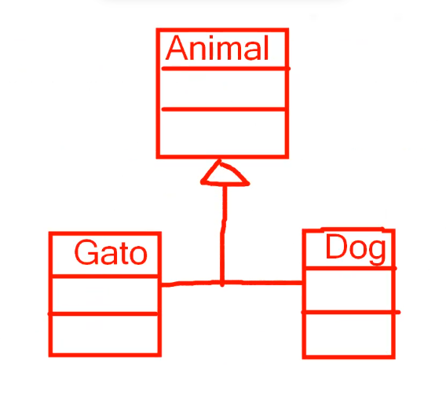
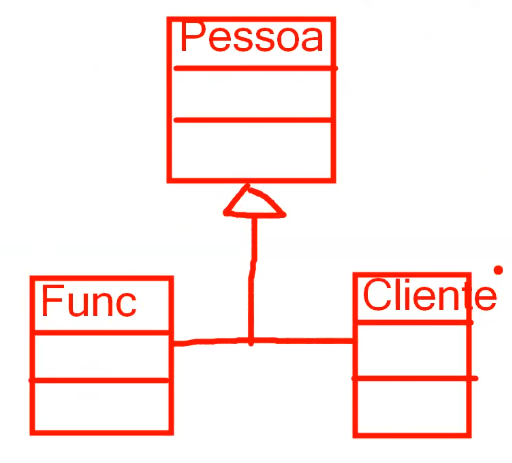

# Aula 2 - 31/07/2025

## Abstração
Representar problemas do mundo palpável em programas com o objetivo de reduzir a complexidade no desenvolvimento de software. Ou seja, abstrações mais fieis e completas facilitam a manutenção de projetos de software.

## Complexidade
Assim como o processo de desenvolvimento de software, o mundo real também é complexo, logo, mesmo que o objetivo da abstração seja reduzir essa complexidade ela ainda é pertinente. Por isso, particionar e encapsular os componentes de um sistema é fundamendal na evolução do software.

## Framework
A escolha e o dominio sobre um framwork para um projeto de software é uma peça fundamental pra facilitar a comunicação entre os componentes.

## Estrutura de Dados
Principal característica valorizada pelas big techs pois é através do uso correto de cada estrutura que permite o sistema atenda a milhares de usuários todos os dias.

## _Information Hiding_
Ocultar a lógica desenvolvida em uma aplicação transforma as ações que a aplicação executa mais simples. Logo, para o usuário como sua solicitação está sendo atendida não importa, contanto que ela chegue no resultado esperado.

## Encapsulamento
Pilar da POO que oculta e protege as informações do código, exemplo métodos getter() e setter()

# Aula 3 - 04/08/2025

> "Maximize a coesão das classes e minimize o acoplamento entre elas."

## Coesão
Toda classe deve ter uma única responsabilidade, ou seja, um código que deve realizar uma tarefa bem feita. Isso possibilita algumas vantagens:
- Facilitar a implementação;
- Facilitar a alocação de um único recurso para manter a classe;
- Facilita o reuso e teste de uma classe

## Acoplamento

Força de conexão entre duas classes. Diz-se uma classe fortemente acoplável aquela que fica "amarrada" a outra, ou seja, remover um simples método de uma classe associada a outra pode gerar erros na outra classe, enquanto uma baixamente acoplável é adaptátvel, como um cabo USB.

# Aula 4 - 07/08/2025

## SOLID

### Princípio da Responsabilidade Única (**S**)

Esse princípio é uma aplicação direta da ideia de coesão.

Entity <-- Dados
Repository <-- JPA spring data
Services <-- Lógica(use cases)
Controller <-- Api rest

Seta de Herança - Seta com ponta vazada (aberta) e linha contínua
Seta de Variável - Seta com ponta fechada e linha contínua
Seta de Interface - Seta com ponta vazada (aberta) e linha tracejada
Seta de Associação - Seta com ponta fechada e linha tracejada

### Príncio da Segregação de Interface (**I**)

Esse princípio está diretamente relacionado à ideia de coesão, mas com foco específico na definição de responsabilidades das interfaces. Em outras palavras, cada interface deve ser projetada para atender exclusivamente às necessidades de uma entidade ou funcionalidade específica.

No exemplo apresentado em aula, foi desenvolvida uma interface gráfica utilizando a biblioteca Swing do Java, que realiza duas ações distintas:

- Exibir uma janela modal com uma mensagem na tela
- Registrar e exibir os movimentos do mouse

Embora ambas as ações estejam dentro do mesmo contexto visual, a separação das responsabilidades é clara. Cada tipo de evento é tratado por uma interface específica.

# Aula 5 - 11/08/2025

### Príncio da Inversão de Dependências (**D**)

> "Prefira Interfaces a Classes"

Exemplo levando em consideração a disciplina de fábrica de software:
Os controladores devem estabeler dependências prioritaramente com as interfaces de serviço e não com as implementações de serviço concretas.

Tal princípio atua na redução do acoplamento.

### Prefira Composição a Herança

Herança expoe para subclasses detalhes de implementação das classes pai, o que viola o princípio do encapsulamento em POO, por isso, é preferível o uso de composições (associações)

Herança só deve ser utilizada caso as subclasses são uma divisão exata (uma substituição). Exemplo:

\
Um gato não pode se tornar um cachorro

\
Um funcionário pode se tornar um cliente.

### Princípio de Demeter

A implementação de um método deve chamar apenas os seguintes outros métodos:

- CASO 1: de sua própria classe;
- CASO 2: de objetos passados como parâmetros;
- CASO 3: de objetos criados pelo próprio método;
- CASO 4: de atributos da classe do método.

O exemplo utilizado na aula para representar o uso do princípio, foi o da criação da janela utilizando a biblioteca Swing, onde o construtor Janelinha() atende as definições acima.

### Principio de Aberto/Fechado

Uma classe deve estar fechada para modificações e aberta para extensões.